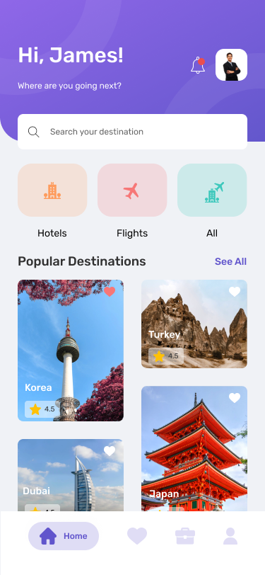

# Travel App

## Giới thiệu

Travel App là một ứng dụng giúp người dùng dễ dàng tìm kiếm và đặt phòng khách sạn trực tuyến một cách thuận tiện. Ứng dụng cung cấp một giao diện đơn giản và thân thiện, cho phép người dùng tìm kiếm phòng khách sạn dựa trên các tiêu chí như địa điểm, giá cả, tiện nghi, đánh giá của khách hàng và nhiều yếu tố khác.

## Tính năng

- **Tìm kiếm và đặt phòng khách sạn:** Người dùng có thể tìm kiếm các khách sạn theo nhiều tiêu chí khác nhau và đặt phòng trực tuyến một cách dễ dàng.
- **Xem thông tin chi tiết:** Ứng dụng cung cấp thông tin chi tiết về từng khách sạn, bao gồm hình ảnh, tiện nghi, đánh giá, vị trí và giá cả.
- **Quản lý đơn đặt phòng:** Người dùng có thể xem và quản lý các đơn đặt phòng của mình thông qua ứng dụng.
- **Tích hợp thanh toán:** Ứng dụng hỗ trợ thanh toán trực tuyến an toàn và tiện lợi cho các đơn đặt phòng.

## Giao Diện

## Splashscreen

## Onboarding

## Home

## Select Room

## Checkout Hotel

## Guest and Room

## Booking Hotel

...
